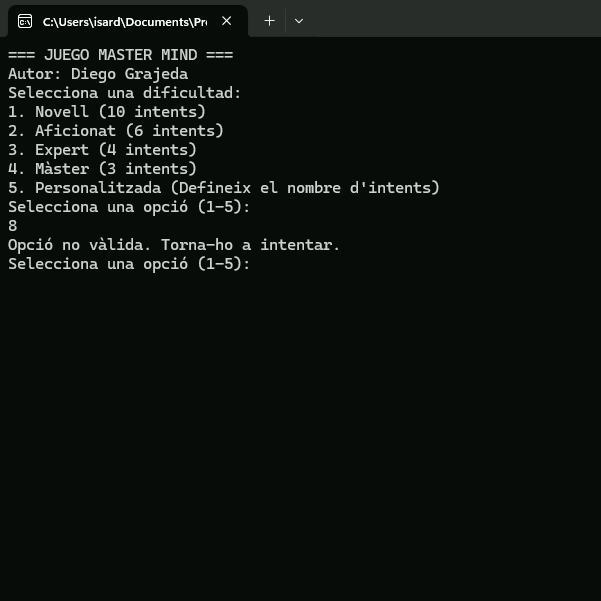

# *MASTERMIND*
### Diego Grajeda Rodriguez
(PD: he trigat, pràcticament, 6 dies dedicant tot els temps que tenia disponible. Penso que no es el millor codi doncs perquè soc bastant novell programant i he necessitat de varies consultes per realitzar segons quines accions en el codi) 

## CRITERIS D'AVALUACIÓ
## Robust
El codi, aparentmen, funciona i no mostra cap ERROR greu en la consola. Fa quasi tot el que es demana però en comptes de demanar un nombre de 4 digits et demana que posis cada digit de la combinacio introduida per l'usuari. Això, es deu a que no hem sortia com fer-ho de l'altra manera i s'hem complicava més el codi.

## Claredat i Ordre
El codi es bastant extens i potser no es molt clar, per aquest motiu es que he posat bastants comenetaris per tal de resoldre possibles dubtes que es generin al llegir el codi.
Respecte a l'orde crec que es bastant confús i potser no es veu ben estructurat, he tractat de dividir-ho en funcions pero nomes he fet 3.
- Funció combinació secreta: aqui podem posar la combinació secreta que volem adivinar, serveix per fer el joc de proves.
- Funció principal: aqui practicament es fa tot, es a dir, es mostra la pantalla principal per escollir dificultat de joc, ens demana introduir els 4 nombres de la combinació, es crida a la funció de compararArrays, ens dona les sortides quan s'acaba el programa.
- Funció compararArrays: aqui compara la array on es troba la combinacio secreta i l'array on tenim els 4 nombres introduits per nosaltres, depenent si surten o no generem els simbols que retornarem en la pista.

## Variables i constants
He tractat que la majoria de variables tinguin noms explicatius tot i que, alguns noms son pareguts o no queden masa clars. Les variables i constants utilitzades no es troben al principi del codi i tampoc estan en anglès perquè hem queda més clar a mi en català/castellà.

## Estructures de control
Com no sabia ben bé com finalitzar alguns bucles/condicions he necessitat utilitzar algun break o continue en lloc on no hi habia un switch.

## Gestió d'errors
Crec que la majoria d'errors es gestionen, es a dir, si l'usuari introdueix algun valor que la condició no acepta llavors et torna a demanar un valor valid.

## Disseny modular
Crec que el disseny modular es bastant pobre o inexistent.

## Jocs de Proves
Hi ha diferents jocs de proves realitzats, estan com imatges al repositori.
He tractat que siguin variats.

### Cas 1

Comprovem si en la pantalla principal a l'hora de escollir alguna dificultat poso una opcio no disponible -->

Input:
- opcio: 8

Output:
- Valor esperat: opció no vàlida, posa una altra opció disponible
- Valor obtingut: opció no vàlida, posa una altra opció disponible

### Cas 2

Comprovem si en la pantalla principal quan seleccionem opcio 5, escollir nombre d'intents, introduim un nombre d'intents fora del rang (1-99) -->

Input:
- opcio: 5
- nombre d'intents: 100

Output:
- Valor esperat: nombre d'intents no vàlid
- Valor obtingut: nombre d'intents no vàlid i torna a demanar escollir una opció de dificultat

### Cas 3

Comprovem si combinacio de l'usuari accepta (1111) extrem del rang més petit -->

Input:
- Combinacio secreta: 1111
- Combinacio d'usuari: 1111

Output:
- Valor esperat: Guanyes
- Valor obtingut: Guanyes

### Cas 4

Comprovem si combinacio de l'usuari accepta un nombre dins del rang pero no es la combinacio secreta -->

Input:
- Combinacio secreta: 4521
- Combinacio d'usuari: 4632

Output:
- Valor esperat: OXXØ
- Valor obtingut: OXXØ

### Cas 5

Comprovem si combinacio de l'usuari accepta un nombre fora del rang -->

Input:
- Combinacio secreta: 4545
- Combinacio d'usuari: -1048

Output:
- Valor esperat: nombre no vàlid i torna a introduir un nombre vàlid (cada digit que no compleix)
- Valor obtingut: nombre no vàlid i torna a introduir un nombre vàlid (cada digit que no compleix)

### Cas 6

Comprovem que pasa quan introduim un string -->

Input:
- Combinacio secreta: 4545
- Combinacio d'usuari: h545

Output:
- Valor esperat: nombre no vàlid i torna a introduir, en aquest cas, el primer nombre de combinacio d'usuari
- Valor obtingut: nombre no vàlid i torna a introduir, en aquest cas, el primer nombre de combinacio d'usuari

### Cas 7

Comprovem que passa quan introduim una combinacio dintre del rang pero tot errat -->

Variables:
- Combinacio secreta: 4545
- Combinacio d'usuari: 1111

Output:
- Valor esperat: XXXX
- Valor obtingut: XXXX

### Cas 8

Comprovem que passa quan hem arribat al limit de intents -->

Variables:
- IntentsMax: 1
- Intents: 1

Output:
- Valor esperat: joc terminat, combinacio secreta...
- Valor obtingut: joc terminat, combinacio secreta...

## UX/UI
L'interfaç crec que s'enten prou bé a l'hora de jugar i sempre que llegeixis el que posa.

## Extres
No he fet cap extra perquè si ja m'ha costat fer la part obligatoria, els extres els veig a un nivell impossible per mi. No hem veig capaç de fer-los i tampoc de modificar el codi que ja tinc per tal de fer els extres.
